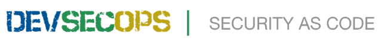
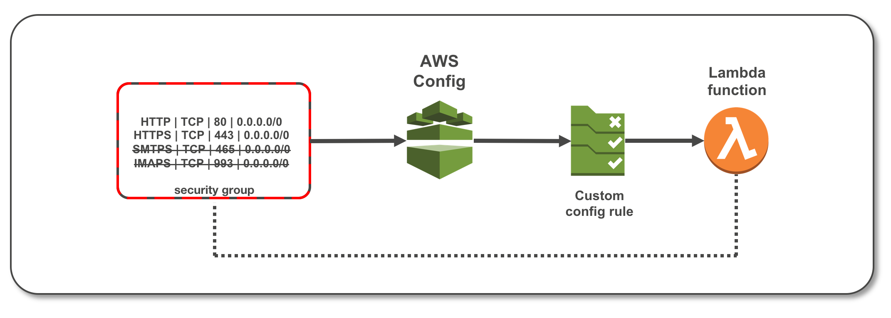

# DevSecOps_Cloud_Automation_AWS 
This Repository Deal with **AWS Cloud Security Compliance Automation** through DevSecOps.

We will perform following actions as part of **DevSecOps**
  - **Continuous-Compliance/Continous-Remediation** through Custom Config Rules Deployment for AWS eco-system which includes compliance verification(inclduing Security compliance, CSI, PCI DSS, ISO..etc) and Auto-Remediation
  - Periodic Remediation with Advanced Reporting(**SecOps**)
  - Automated response to remediate incidents in near real-time(**Self-Healing**)


### Continuous-Compliance/Continous-Remediation Through Custom Config Rules
AWS Config Rules allows you to create rules that continuously check the configuration of relevant AWS resources recorded by AWS Config, and notifies you when resources do not comply with these guidelines. with Config we can define out-of-the-box rules that covers high-security compliance and also cover highly regulated industries like BFSI which usually have special requirements that need specific definitions of compliant.

Advantages:
  - Conntinous-compliance for user changes through Custom AWS Config Rules
  - Continous-Remediation for non-complaint resources and action
  - Preventive and "NoOps" Strategy

In current automation we will set-up a Continuous-Compliance/Continous-Remediation Pipeline which will check the Security compliance and remediates non-complaint resource automatically. 

##### Architecture:

[](# "Continuous-Compliance/Continous-Remediation")

As per the above architecure, If any try User tries to perform non-complaint operation in AWS then such changes will be tracked through AWS Config using Custom Rulesets and respective remediation action(Lambda) will be triggered through SNS Topic.


### Monitoring Security Groups with AWS Config

Let's setup AWS Config Rules with an AWS Lambda function for continous-monitoring of the ingress ports associated with an EC2 security group.   The Lambda function will be triggered whenever the security group is modified.  If the ingress rule configuration differs from that which is coded in the function, the Lambda function will revert the ingress rules back to the appropriate configuration.  The activity from the Lambda function can then be viewed through Amazon CloudWatch Logs.  In an accompanying lab, Monitoring Security Groups with Amazon CloudWatch Events, you will use a different set of services to monitor security groups.  These two labs demonstrate techniques that can be used to provide additional layers of protection to infrastructure assets.

##### Architecture Overview



As per the above architecure, If any try User tries to perform non-complaint operations such port changes in AWS Security Group then such changes will be tracked through AWS Config using Custom Rulesets and respective remediation action(Lambda) will be triggered and security group will be reverted back with original state. 

This same implementation we can replicate for multiple usecases for building Security incidents Self-healing Architecture.


## Adding a Rule to AWS Config
### With the RDK

The RDK is designed to support a **"Compliance-as-Code"** workflow that is intuitive and productive. It abstracts away much of the undifferentiated heavy lifting associated with deploying AWS Config rules backed by custom lambda functions, and provides a streamlined develop-deploy-monitor iterative process.

If you just want to use the RDK, go ahead and install it using pip(make sure aws-cli installaed and configured before):
```sh
pip install rdk
```
Now deploy AWS Custom Config rules using
```sh
rdk deploy NAME_OF_THE_RULE
```

### Manually
You can use the sample functions in this repository to create Config rules that evaluate the configuration settings of your AWS resources. First, you use AWS Lambda to create a function that is based on the sample code. Then, you use AWS Config to create a rule that is associated with the function. When the rule’s trigger occurs, AWS Config invokes your function to evaluate your AWS resources.

Add a rule to AWS Config by completing the following steps. For more detailed steps, see [Developing a Custom Rule for AWS Config](http://docs.aws.amazon.com/config/latest/developerguide/evaluate-config_develop-rules_nodejs.html) in the *AWS Config Developer Guide*.

1. Navigate to the AWS Lambda Console.
	- Sign in to the AWS Management Console and open the [AWS Lambda console](https://console.aws.amazon.com/lambda/).
	- Verify that your region is set to one that supports AWS Config rules.
	- For the list of supported regions, see [AWS Config Regions and Endpoints](http://docs.aws.amazon.com/general/latest/gr/rande.html#awsconfig_region).
2. Create a Lambda function.
	- Provide your code using the method required by the code entry type that you choose.  
	- If you are adding a Python, you can copy and paste the code from the repective rule that you want to use. 
	- For the role that you assign to your function, choose the **AWS Config Rules permission** option. This includes *AWSConfigRulesExecutionRole*, an AWS managed policy that allows your Lambda function permission to "put" evaluations.
	- For **Handler**, if you are adding a Python function, keep the default value. 
3. After you create the function, take note of its ARN.  
4. Open the [AWS Config console](https://console.aws.amazon.com/config/).   
	- Verify that your region is set to the same region in which you created the AWS Lambda function for your custom rule.  
5. Use the AWS Config console to add a custom rule.  
	- For **AWS Lambda function ARN**, specify the ARN of the function that you created.
	- Specify **Trigger type**, if you are using any of the *triggered samples* from this repository, choose **Configuration changes**. If you are using any of the *periodic* samples from this repository, choose **Periodic**.
	- For the rule parameters, specify any required parameters.
	- For the trigger types and required parameters for each function, see [AWS Config Rules]
	- **Note**: Make sure to modify AWS Config settings with appropriaate SNS Topic for triggering Lambda as part of Self-Remediation

After you create the rule, it displays on the **Rules** page, and AWS Config invokes its Lambda function. A summary of the evaluation results appears after several minutes.

### Periodic Remediation with Advanced Reporting(**SecOps**)
In this process we can configure AWS Config rules to trigger perodically and notify AWS Lambda for Remdiation 
##### Architecture:

[](# "SecOps")

As per the above architecure, If any try User try perform non-complaint operation in AWS then such changes will be tracked through AWS Config peridically and respective remediation action(Lambda) will be triggered.


### Automated response to remediate incidents in near real-time(**Self-Healing**)


Self-healing Architecture through CloudWatch
